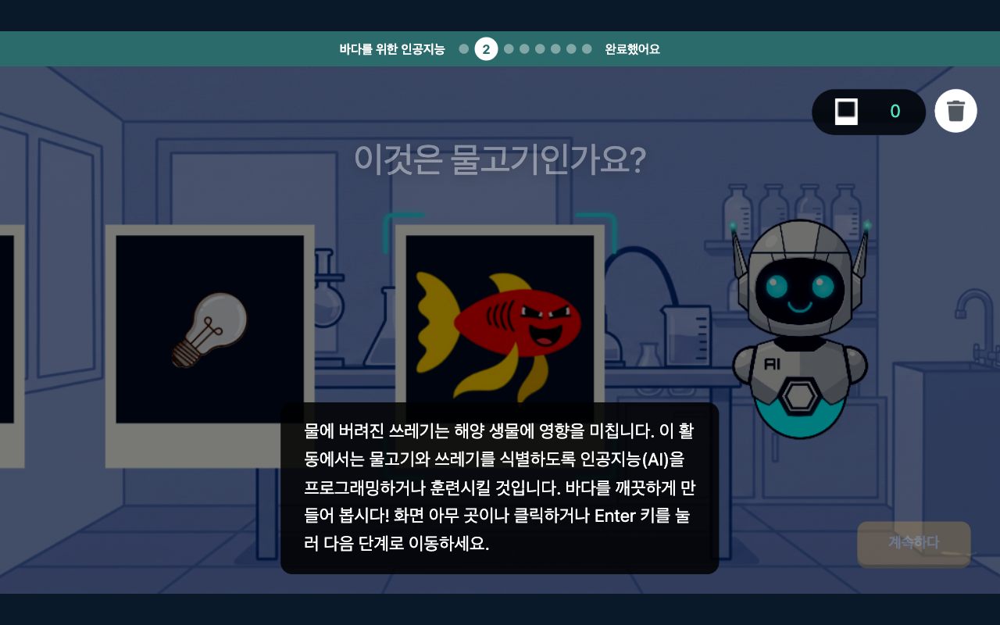
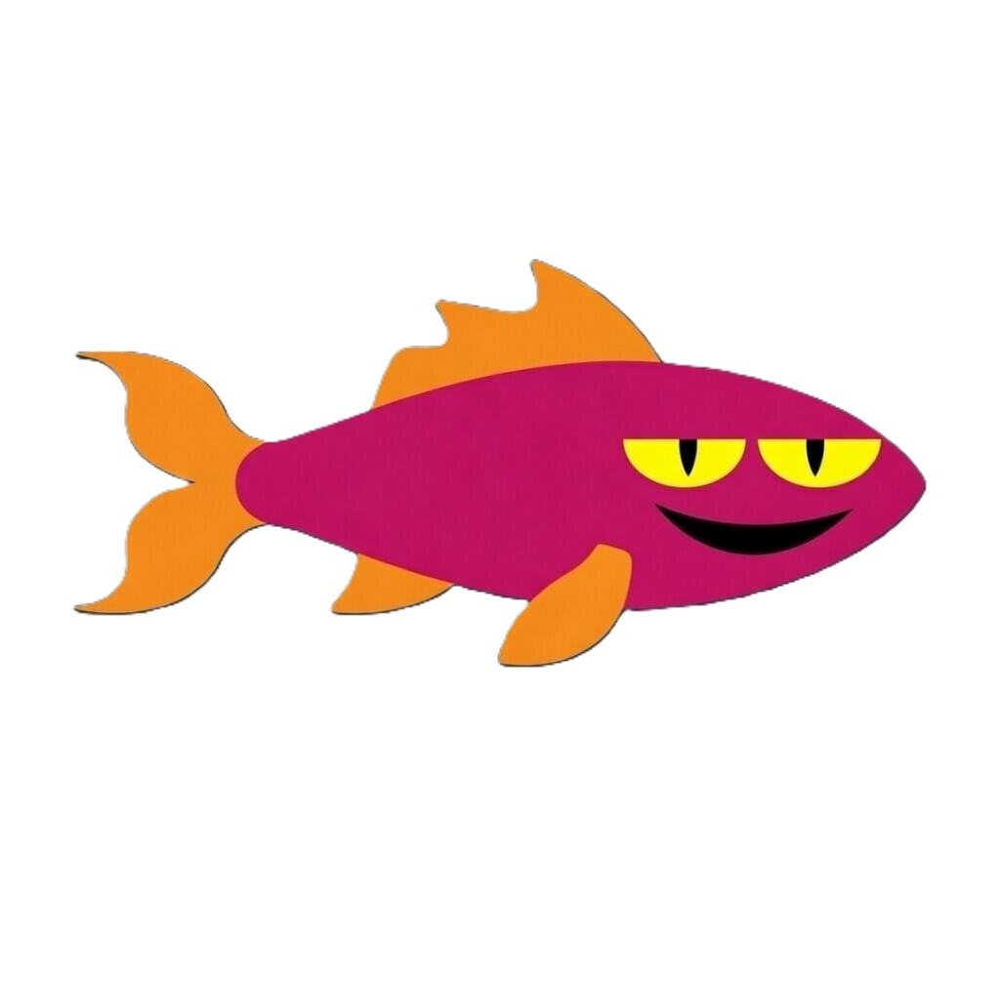
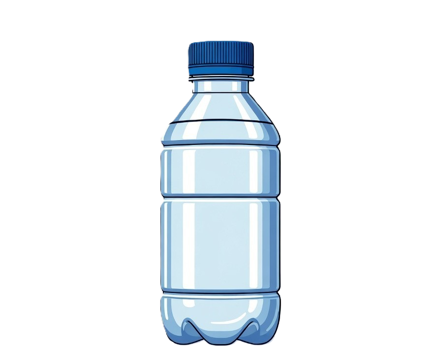

# 🐟 AI 해양 탐사 - 물고기 분류기

<p align="center"></p>

> 플레이어가 직접 인공지능(AI)을 "훈련"시켜 물고기와 해양 쓰레기를 분류하는 교육용 인터랙티브 미니게임

바닷속 물체를 하나씩 보고 **물고기**인지 **쓰레기**인지 레이블을 지정하면, AI가 그 데이터를 학습합니다. 학습이 끝나면 AI가 스스로 바다를 탐사하며 물고기를 식별하는 모습을 확인할 수 있습니다. "AI는 사람이 가르친 대로 배운다"는 머신러닝의 핵심 개념을, 코드 한 줄 없이 직접 체험하도록 설계한 작품입니다.

---

## 📖 소개

해양 오염 문제를 소재로, 지도학습(Supervised Learning)의 원리를 놀이로 풀어낸 브라우저 기반 교육 게임입니다.

- **훈련 단계**: 컨베이어 벨트 위로 흘러오는 물체를 보고 `물고기` / `Not 물고기` 버튼으로 레이블링하면, 각 선택이 곧 AI의 학습 데이터가 됩니다.
- **탐사 단계**: 훈련된 AI가 직접 바닷속을 탐사하며 그동안 배운 패턴으로 물고기와 쓰레기를 구분합니다.
- **핵심 메시지**: 사용자가 "잘못된" 레이블을 주면 AI도 똑같이 잘못 배웁니다. 데이터의 질과 양이 AI 성능을 결정한다는 점을 직접 느끼도록 구성했습니다.
- 중간중간 등장하는 *Did you know?* 팝업으로 실제 해양 오염 통계를 함께 전달합니다.

외부 ML 라이브러리나 사전 학습 모델 없이, **k-최근접 이웃(KNN) 분류기를 직접 구현**하여 게임 내부에서 실시간으로 학습·추론합니다.

---

## ✨ 주요 기능

- **직접 구현한 KNN 분류기** — 물체의 색상 밝기·채도·크기 등 5개 특징(feature) 벡터를 추출하고, 유클리드 거리 기반 k=3 다수결로 분류합니다. 신뢰도(confidence)가 낮으면 "판단 보류"를 반환하도록 처리.
- **단계형 스토리텔링 흐름** — 인트로 → 훈련(train) → 바다 도입(ocean-intro) → 탐사 실행(ocean-run) → 리뷰(review) → 결과(result)로 이어지는 상태 머신 기반 진행.
- **컨베이어 벨트 훈련 UI** — 물체가 연속으로 흘러오고, 선택 횟수(5/15/30회)마다 학습을 독려하는 메시지가 타이핑 효과와 함께 표시됩니다.
- **AI 탐사 시뮬레이션** — 훈련된 모델로 바닷속 물체를 차례로 예측하며, 되감기/일시정지/빨리감기 재생 컨트롤을 제공합니다.
- **리뷰 & 결과 화면** — AI가 물고기/쓰레기로 분류한 결과를 모아 보여주고, 최종 정확도(%)를 산출합니다.
- **순수 Canvas 2D 렌더링** — 물고기, 로봇, 사진 프레임(스캐너 효과), 바다 배경과 거품 등 모든 그래픽을 코드로 그립니다.
- **반응형 캔버스 레이아웃** — `ResizeObserver`와 종횡비 계산으로 어떤 화면 크기에서도 1024×576 논리 해상도를 비율에 맞게 스케일링.
- **사운드 & 인터랙션** — 버블, 클릭, 분류, 레이저 등 효과음과 키보드(Enter)·포인터 입력 지원.
- **견고성 처리** — 사용자 입력 텍스트 XSS 방어(sanitize), 런타임 에러 수집/배칭, 캔버스 썸네일 캡처(`html-to-image`) 등 운영 단계 고려.

---

## 🛠 기술 스택

| 구분 | 사용 기술 |
| --- | --- |
| 언어 | **TypeScript** (ES2020 타깃, 컴파일된 `*.js`를 브라우저에서 직접 로드) |
| 렌더링 | **HTML5 Canvas 2D API** (외부 게임 엔진 미사용) |
| AI/ML | **직접 구현한 KNN 분류기** (유클리드 거리 · 특징 벡터 · 다수결 추론) |
| 사운드 | Web **Audio** API (`HTMLAudioElement`) |
| 빌드 | `tsc` (`tsconfig.json` 기반, 번들러 없음) |
| 모듈 로딩 | 네이티브 ES Modules + `importmap`(CDN, `html-to-image` 등) |
| 캡처 | `html-to-image` (캔버스 → PNG 썸네일) |

> 게임 로직 자체는 의존성이 거의 없는 바닐라 TypeScript로 작성되어, 별도 번들링 없이 정적 서버만으로 동작합니다.

---

## 🚀 실행 방법

빌드 도구나 `npm install` 없이, 컴파일된 `main.js`를 `index.html`이 직접 불러옵니다. **정적 파일 서버로 폴더를 서빙**하기만 하면 됩니다. (`data.json`을 `fetch`하므로 `file://` 직접 열기는 동작하지 않습니다.)

### 방법 1 — npx serve (권장)

```bash
git clone https://github.com/suckhee0227/sea-illustration-ai.git
cd sea-illustration-ai
npx serve .
```

출력된 주소(예: `http://localhost:3000`)를 브라우저에서 엽니다.

### 방법 2 — Python 내장 서버

```bash
cd sea-illustration-ai
python3 -m http.server 8080
```

브라우저에서 `http://localhost:8080` 접속.

### 방법 3 — VS Code Live Server

VS Code에서 폴더를 열고 `index.html`을 우클릭 → **Open with Live Server**.

### (선택) TypeScript 재컴파일

소스(`*.ts`)를 수정한 경우에만 필요합니다.

```bash
npx tsc
```

`tsconfig.json` 설정에 따라 `main.js`, `app.js`, `appHelper.js`가 다시 생성됩니다.

---

## 📂 프로젝트 구조

```
sea-illustration-ai/
├── index.html            # 진입점 — 캔버스/UI 레이어, importmap, main.js 로드
├── main.ts / main.js     # 부트스트랩: 캔버스 레이아웃·리사이즈·부모 메시지 처리, initApp() 호출
├── app.ts / app.js       # 게임 코어 — 상태 머신, KNN 분류, 렌더링, 훈련/탐사/리뷰 로직
├── appHelper.ts / .js     # 데이터 로딩, 좌표 변환, 텍스트 sanitize, 캔버스 캡처 유틸
├── data.json             # 캔버스 크기·물고기 팔레트·텍스트(인트로/통계 등) 콘텐츠
├── style.css             # UI 레이어 스타일 (버튼, 팝업, 네비게이션 등)
├── tsconfig.json         # TypeScript 컴파일 설정 (ES2020)
├── app_metadata.json     # 앱 메타데이터 (제목·설명·카테고리)
├── background*.png, sky.png, green.png, red.png   # 배경/연구실 그래픽
├── image/
│   ├── fish/             # 물고기 일러스트 (fish1~fish22)
│   ├── trashfolder/      # 쓰레기 일러스트 (병·캔·타이어 등 13종)
│   └── ui/               # UI 아이콘 (카운터·휴지통·화살표 등)
└── sound/                # 효과음 (버블·클릭·분류·레이저 등 7종)
```

---

## 🖼 미리보기 에셋

게임에 사용되는 그래픽 에셋 일부:

| 물고기 | 쓰레기 | UI |
| --- | --- | --- |
|  |  |  |

> 위 이미지는 게임 내에서 분류 대상으로 등장하는 실제 에셋입니다.
